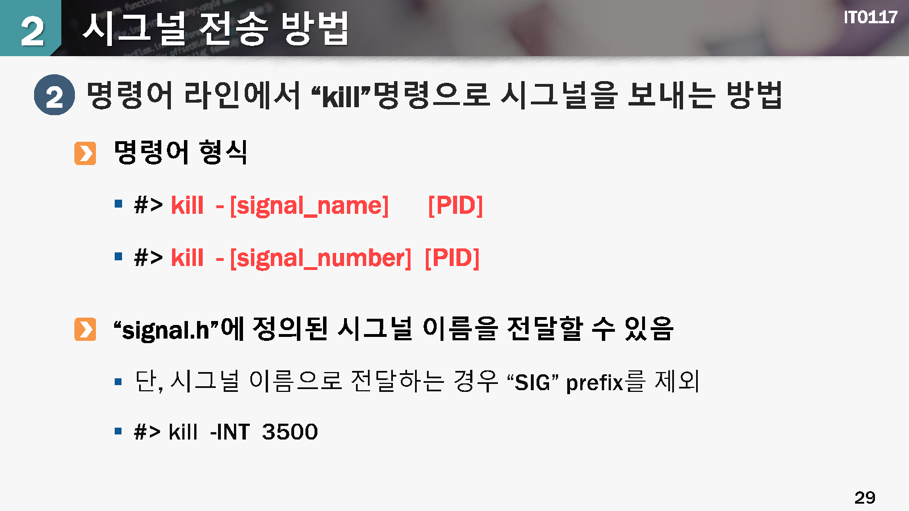

# 프로세스간 통신

# 

## 학습목표

* 프로세스들간의 `통신 기법`중에서 널리 활용되고 있는 기법들을 활용할 수 있다.
* 프로세스들간에 데이터를 주고 받는 `예제코드를 작성`하여 프로세스간 통신 기법을 이해한다.
* 

## 학습내용

1. 프로세스간 통신의 개념
2. 시그널(Signal)
3. 파이프(pipe)와 피포(FIFO)
4. 공유메모리

## 1.프로세스간 통신의 개념

aaa

## 프로세스간의 정보교환

운영체제는 기본적으로 프로세스들을 보하하기 위하여 임의의 프로세스가 다른 프로세스의 메모리에 접근하는 것을 금지하며, 오로지 `운영체제만 모든 프로세스의 메모리에 접근 가능`합

프로세스들은 서로 `협력`적인 작업을 수행하기 위해서 정보를 주고받는 작업이 필요함

프로세스간에 정보를 교환한다는 것은 프로세스의 독립적인 동작을 더 이상 유지하지 않기 때문에, 운영체제에게 정보교환과 관련한 시스템 함수를 호출해야 함

프로세스간 통신을 지원하기 위한 대표적인 매커니즘

* 파이을 이용한 통신
* 시그널(signal)
* 파이프(pipe) 와 피포(fifo)
* 세마포(semaphore)
* 공유메모리(shared memory)
* 메시지큐(message queue) 와 소켓(socket)

### 시그널(signal)

* 프로세스에게 `이벤트가 발생하였음`을 알려주는 방식

예) ctrl+c 를 누르면 SIGINT가 발생하여 프로그램이 종료됨

* 시그널은 이벤트 발생만 알려주며 그 외의 데이터 전달에 사용할 수 없음
* 시그널을 수신한 프로세스는 기존의 동작을 멈추고 시그널 처리 절차를 수행함
* 

### 파이프(pipe)와 피포(fifo)

*  프로세스간에 정보교환을 위하여 `특수 파일`의 형태로 지원
* 파이프 = 부모/자식 프로세스간에 사용할 수 있는 "이름없는 파일"로서 역할
* 피포 = 부모/자식 프로세스 관계가 아니더라도 통신에 사용할 수 있는 "이름있는 파이프"
* 정보를 보내는 프로세스는 wite(0, 정보를 수신하는 프로세스는 read() 함수를 호출

### 메시지 큐(message Queue)

* 프로세스간에 가변길이의 메시지를 전달하기 위하여 커널 내부의일정 크기의 버퍼(mail box)를 이용하는 방식

* 메시지 쿠로 데이터를 전송할 때마다 시스템 호출

  > 문맥전환 발생

* 데이터 복사도 2차례 발생

  >  속도가 느리고 시스템 부하가 많이 증가

* 단방향 통신 경로로서 방향별로 1개씩의 메시지 큐를 사용

  

### 공유메모리 (shared Memory)

* 여러 프로세스가 함께 사용하는 `공통의 메모리 공간`
* 임의의 프로세스가 공유메모리에 데이터를 기록하고, 다른 프로세스에서 데이터를 읽음

## 2. 시그널(Signal)

aaa

### 시그널 기본 개념

시스널이란

* 다양하고 `중요한 이벤트`를 프로세스에게 전달하는 메커니즘

* 각 시그널은 정수 숫자를 가지며 별도의 `심볼(예:SIGINT)`로 표현함

* 프로세스는 시그널을 처리하기 위하여 별도의 `시그널 핸들러`를 보유할 수 있음

  > 시그널을 받으면 미리 약속된 시그널 핸들러가 호출되어 처리되거나, 또는 핸들러가 없는 경우에는 사전에 정의된 기본동작(현재 프로세스의 중단 혹은 시그널 무시)을 수행함

aaa

시그널 발생형태

+ 필요에 의한 소프트웨어적인 시그널
+ 치명적인 오류 발생으로 인한 시그널

시그널의 예

* 진행중인 프로세스를 ctrl+c 키를 눌러서 강제로 종료
* "kill" 명령어를 이용한 프로세스 종료
* wait()에서 깨어나기 (child process의 종료 혹은 상태 변화)
* 프로세스간의 이벤트 정보 교환

aaa

### 시그널 처리과정

일반적인 시그널 처리과정

1.  프로세스 #2는 프로세스 #ㅂ에게 "signal-A"를 발생 시킴
2. 시그널은 운영체제에 의해서 PCB(Process control Block)에 일시적으로 저장됨
3. PCB에 저장된 시그널은 잠시 후에 프로세스 #1에게 전달됨
4. 프로세스 #1이 시그널을 처리할 핸들러를 가지고 있으면 핸들러가 수행됨

aaa

aaa

#### 시그널의 종류

* SIGABRT : abort 함수를 호출하면 보내지며, 이 시그널을 받으면 코어 덤프하고 종료

aaa

aaa

aaa

## 시그널 전송방법

aaa

aaa

aaa

aaa

aaa

aaa

aaa

aaa

aaa

aaa

## 함수

aaa

aaa

aaa

## 3. 파이프(pipe)와 피포(fifo)

## 파이프의 개념

#### 파이프(pipe)

* 한 프로세스의 표준출력을 다른 프로세스의 표준입력으로 연결하는 방법

* 작은 기능을 갖는 여러 개의 프로그램을 엮어서 하나의 큰 프로그램으로 구성할 수 있도록 함

* 유닉스/리눅스의 쉘에서 널리 활용되고 있음

  

#### 파이프의 개념

## pipe() 함수

aaa

aaa

aaa

aaa

## FIFO의 개념

#### 파이프의 문제점

* 부모 프로세스와 자긱 프로세스간에서만 사용 가능함
* 프로세스가 종료되면 사라져서 영구적이지 못함
* 위와 같은 뭄제점을 해소하기 위해서 FIFO가 제안된

#### FIFO = 이름을 가진 파이프 (named pipe)

* 프로세스간의 부모/자식 관계에 상관없이 FIFO파일에 데이터를 쓰거나 읽음으로써 프로세스간에 통신을 수행할 수 있음
* 파일시스템 내에서 특수한 장치 파일로서 존재함

#### mkfifo()

aaa

aaa

## 4.공유 메모리

## 공유 메모리의 개념

### 공유메모리

* 운영체제 보호기능으로 인하여 프로세스 상호간에 메모리를 침범하지 못하기 때문에, 여러 프로세스가 이러한 제약 조건을 제거하는 것에 동의한다는 가정하에 메모리를 공유하는 방식
* 프로세스 상호간의 동의를 바탕으로 일정 메모리 영역을 공유 메모리 영역으로 제공함. 관련된 프로세스들은 자유롭게 데이터를 읽어나 쓰는 동작을 수행할 수 있음
* 

#### 특징

* 공유 메모리를 설정할 때에만 시스템 호출이 발생하고, `이후에는 운영체제가 관여하지 않기` 때문에 속도가 빠르고 cpu 성능 저하도 적음
* 여러 프로세스가 동시에 동일한 메모리 영역에 데이터 쓰기 동작 수행시 결과를 예측할 수 없음 =>  프로세스간의 약속이나 `상호배제`가 필요
* 공유메모리 사용절차

생성 -> 부착 -> 스기 -> 일기 -> 해제

 

aaa

aaa

aaa

## 공유메모리 시스템 호출

aaa

aaa

aaa

aaa

aaa

aaa

aaa

## 확인하기

## 정리하기

1. 프로세스들은 서로 협력적인 작업을 수행하기 위해서 데이터를 주고 받는 작업이 필요하며, 유닉스 계열의 운영체제에서는 이를 지원하기 위해서 파이프, FIO, 세마포, 공유메모리, 메시지큐, 소켓등을 제공한다.
2. 시그널(signal)은 다양하고 중요한 이벤트를 프로세스에게 알려주는 수단으로 활용된다.
3. 시그널을 받은 프로세스는 수행중이던 작업을 중지하고 시그널을 처리하며 이를 위한 별도의 `시그널 핸들러`를 정의할 수 있다.
4. 파이프(pipe)는 한 프로세스의 표준출력을 다른 프로세스의 표준입력으로 연결하는 방법이다.
5. 피포(FIFO)느 이름을 가진 파이프라고도 하며, 특별한 장치 파일로 존재한다. FIFO파일을 생성한 이후에 데이터를 쓰거나 읽음으로서 프로세스간에 통신을 활 수 있다.
6. `공유메모리`는 여러 프로세스가 함께 사용하는 메모리를 의미한다. 다라서 임의의 프로세스가 공유메모리에 데이터를 쓰면 다른 프로세스에서 해당 내용을 읽을 수 있다.

