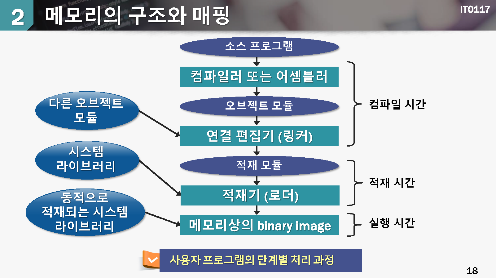
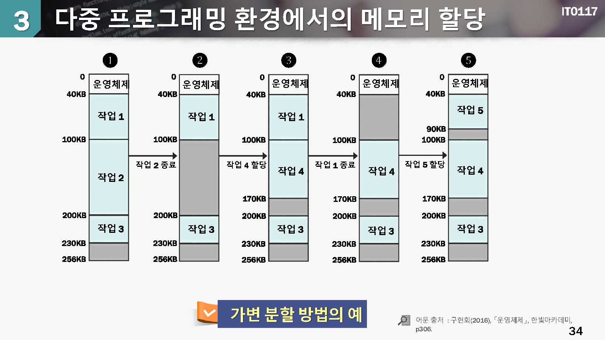
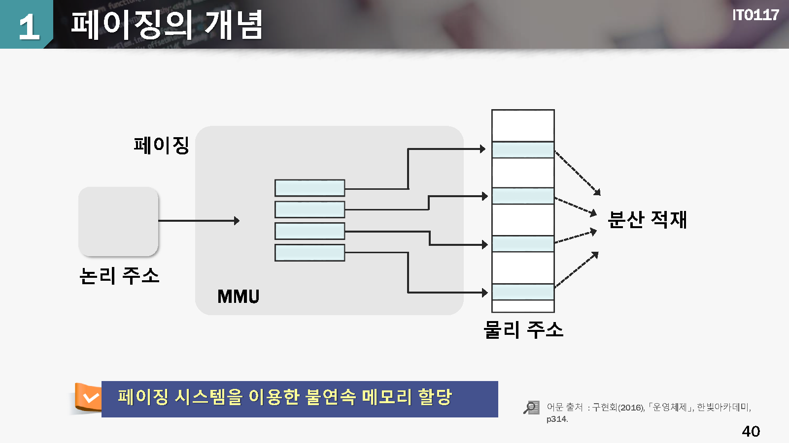
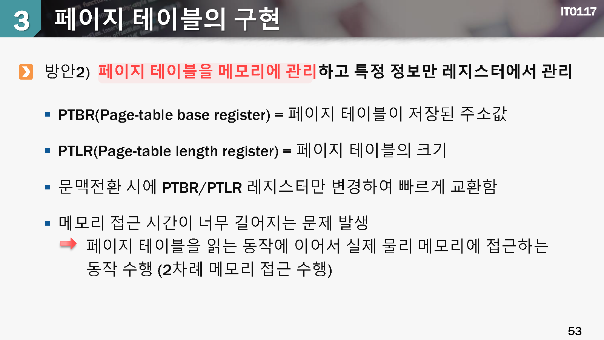
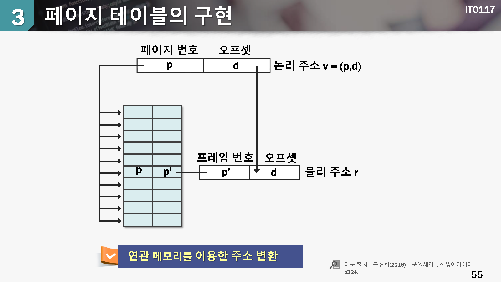
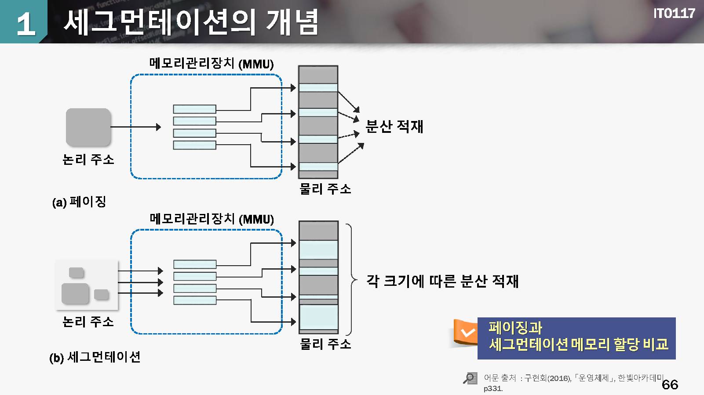
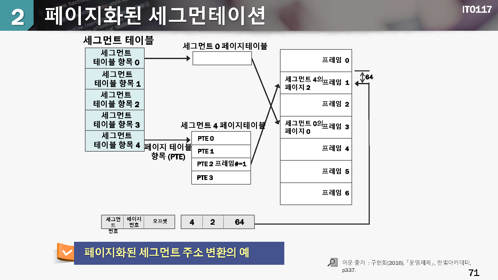

# 10 메모리 관리

## 학습목표

* 메모리를 관리하는 정책과 할당 방법을 설명할 수 있다.

* 연속 메모리 할당 방식과 분산 메모리 할당 방식의 차이를 이해할 수 있다.

* 분산 메모리 할당 방식인 페이징 방식과 세그먼테이션 방식을 설명할 수 있다.

  

## 학습내용

1. 메모리 관리의 개요
2. 연속 메모리 할당
3. 분산 메모리 할당: 페이지
4. 분산 메모리 할당 : 세그먼테이션

# 1. 메모리 관리의 개요

## 메모리의 개요

#### 메모리의 용도

* CPU가 **명령어나 데이터를 읽거나 저장**할 수 있는 기억장치
* 프로그램이 수행되려면 반드시 메모리에 적재 되어야 함 => 폰 노이만 방식
* 메모리의 분류 : 레지스터, 캐시, 메인 메모리, 보조기억장치 => 속도, 용량, 가격의 차이

#### 메모리 관리

* 프로세스들에게 메모리를 **할당** 하거나 **회수**하는 동작 혹은 **보호** 하는 동작

* 다중 프로그래밍 시스템에서는 여러 프로세스가 메모리에 동시에 적재되어 동작할 수 있도록 운영체제가 지원함

  

메모리란 프로세스들이 **점유경쟁**해야 하는 한정된 자원

메모리 관리 정책

* 적재정책 : 보조기억장치에서 메모리로 프로세스를 반입하는 시기를 결정하는 정책
* 배치정책: 메모리로 반입한 프로세스를 메모리의 어느 위치에 적재할 것인지를 결정하는 정책
* 대치정책: 메모리가 부족한 경우에 현재 동작 중인 프로세스들중에서 제거할 프로세스를 결정하여 교체하는 정책

## 메모리의 구조와 매핑

#### 주소 할당 (Address Binding)이란?

* 대부분의 시스템에서는 사용자 프로세스가 메모리의 어느 부분에도 적재가 될 수 있음
* 연결 편집기(linkage editor)나 적재기(loader)에서 혹은 실행 시에 재배치 가능한 주소를 절대주소로 바꾸는 것을 주소할당 혹은 주소 바인딩이라고 함

#### 3가지 주소할당 방식

1. 컴파일 시간 바인딩
2. 적재 시간 바인딩
3. 수행 시간 바인딩

컴파일 시간 바인딩

* 코드와 데이터가 위치해야 하는 주소를 미리 알고 있는 경우 절대 주소를 갖는 코드를 생성
* 코드와 데이터의 위치를 변경해야 하는 경우에는 다시 컴파일해야 함

적재시간 바인딩

* 컴파일 단계에서 재배치 가능한 형태의 코드를 생성하고 프로그램을 메모리에 적재하는 시점에 절대주소가 결정됨

수행시간 바인딩

코드와 데이터의 위치가 프로그램이 수행되는 중간에 결정됨

aaa

aaa

#### 정적 링킹(static linking)

이진 코드로 이루어진 프로그램 내부에 라이브러리 코드가 결합하여 공존하는 방식

> 라이브러리 코드는여러 프로그램에서 공통적으로 호출하여 사용하는 루틴이나 함수를 보유하고 있음

동일한 라이브러리 코드가 여러 프로그램 코드에서 반복되기 때문에 디스크 공간과 메모리 공간을 모두 낭비하는 방식

#### 동적 적재 (dynamic loading

*  루틴을 호출하면 메모리에 해당 푸린이 적재되어 있는지를 확인하고, 만약 적재되어 있지 않다면 재비치 가능 연결 적재기(relocatable linking loader)에서 요청하는 루틴을 메모리에 적재
* 자주 실생되지 않지만 거대한 크기의 코드에서는 메모리 사용량을 감소시킬 수 있으므로 유용함
* 운영체제의 특별한 지원을 불필요함. 디스크공간과 메모리 공가을 절약할 수 있음

#### 동적 링킹(dynamic linking)과 공유 라이브러리

* 링킹이 수행시간에 이루어짐
* 동적 라이브러리 루틴이 메모리에 있는지 점검하고 만약에 없는 경우 디스크에서 메모리로 적제하며, 메모리에 있는 경우 동적 링킹을 사용함. 하나의 라이브러리 루틴을 여러 프로세스들이 공유할 수 있음.
* 여러 프로세스들이 동적 링킹된 하나의 라이브러리 주소 공간을 공유함(공유라이브러리) -> 디스크 및 메모리 공간 절약, 운영체제의 지원이 필요함
* 

#### 주소공간의 분류

* 논리주소(logical address) 혹은 가상 주소(virtual address)
* + 프로세스마다 존재하는 가상의 논리 메모리 주소
  + 각 프로세스 이비장에서는 마치 단일 프로세스 환경처럼 느낌
* 믈리주소(physical address)
* + 실제 메모리 하드웨어 접근할대에 사용되는 물리적인 주소

컴파일 시간 바인딩과 적재 시간 바인딩에서는 논리주소와 물리주소가 동일함

#### 수행시간 바인딩에서는

* 논리 주소와 물리 주소는 다르며 수해시간에 바로 변환 작업이 수행됨 -> 빠르게 변환하기 위해서 mmu라는 하드웨어의 도움을 받음
* 컴파일러에서는 논리 주소를 사용한 코드를 사용함
* 프로세스는 물리 주소에 대해서 알 수 없음

aaa

aaa

aaa

# 2. 연속 메모리 할당

aaa

## 메모리 할당 방법

aaa

## 단일 프로그래밍 환경에서의 메모리 할당

aaa

aaa

## 다중 프로그래밍 환경에서의 메모리 할당

aaa

aaa

aaa

aaa

aaa

aaa

aaa

aaa

# 3. 분산 메모리 할당: 페이징

aaa

## 페이징의 개념

aaa

aaa

aaa

aaa

## 페이징 시스템의 하드웨어 구조와 원리

aaa

aaa

aaa

aaa

aaa

aaa

aaa

aaa

aaa

## 페이지 테이블의 구현

aaa

aaa

aaa

aaa

aaa

aaa

aaa

## 공유 페이지

aaa

aaa

## 다중 단계 페이징 시스템

aaa

aaa

# 4.분산 메모리 할당: 세그먼테이션

aaa

## 세그먼테이션의 개념

aaa

aaa

aaa

aaa

aaa

aaa

## 페이지화된 세그먼테이션

aaa

aaa

aaa

## 확인하기

aaa

## 정리하기

1. 다중 프로그래밍 시스템에서 프로게스간의 메모리 관리(할당, 배치, 대치)정책을 사용하여 한정된 메모리 장치를 효율적으로 이용한다.
2. 프로세스는 가상의 논리주소 기반으로 동작하지만 실제로는 논리 주소값과는 다른 물리 주소로 변환되어 동작한다.
3. 메모리에 프로세스를 적재할 때는 크게 2가지 방법이 가능하다. 연속 혹은 분산9비연속)메모리 할당
4. 연속 메모리 할당 정책은 **고정분할** 할당 방시과 **가변분할** 할당 방식으로 구분할 수 있다.
5. 메모리를 할당하면서 사요하지 못하는 공간이 발생하며 형태적으로 내부 단편화와 외부 단편화 현상이 발생한다.
6. 페이징 방식과 세그먼테이션 방식은 프로세스에게 분산 메모리 공간을 할당하며 매핑 테이블을 이용하여 실사간으로 물리주소로 변환한다.
7. 페이징 방식은 고정된 크기의 페이지와 프레임을 프로세스에게 할당하고 페이지 테이블을 사용하여 물리주소로 변환한다.
8. 세그먼테이션 방식은 세그먼트라는 가변의 영역들을 프로세스에게 할당하고 세그먼트 테이블을 사용하여 무릴주소로 변환한다.

