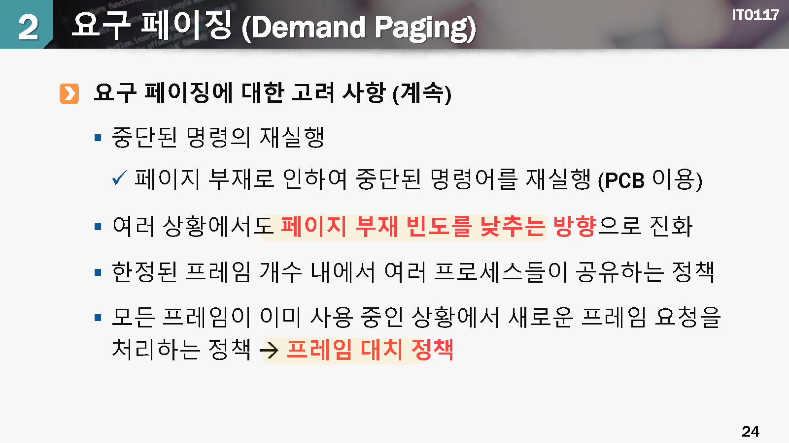
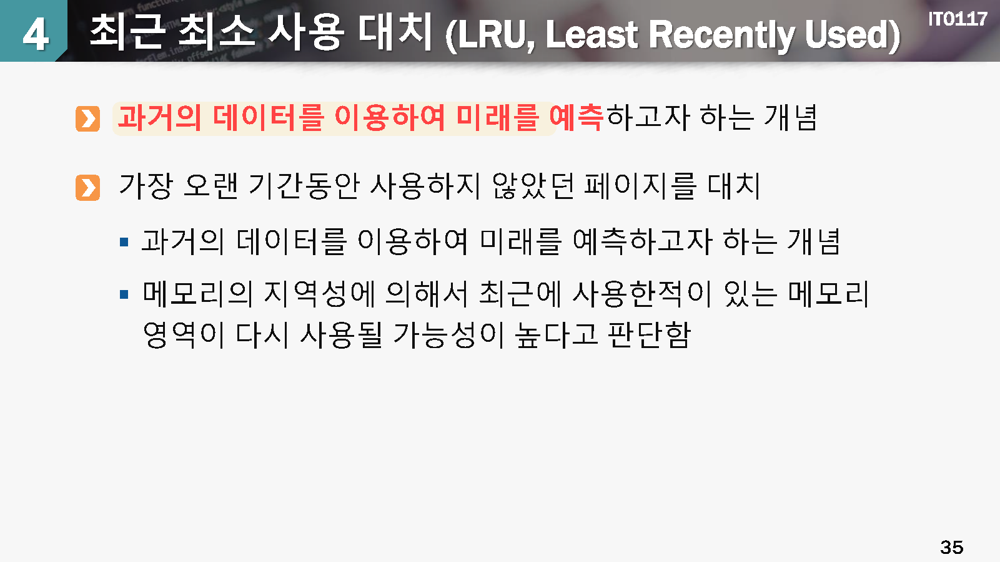
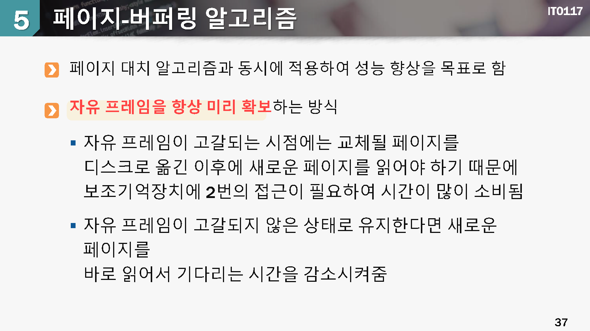
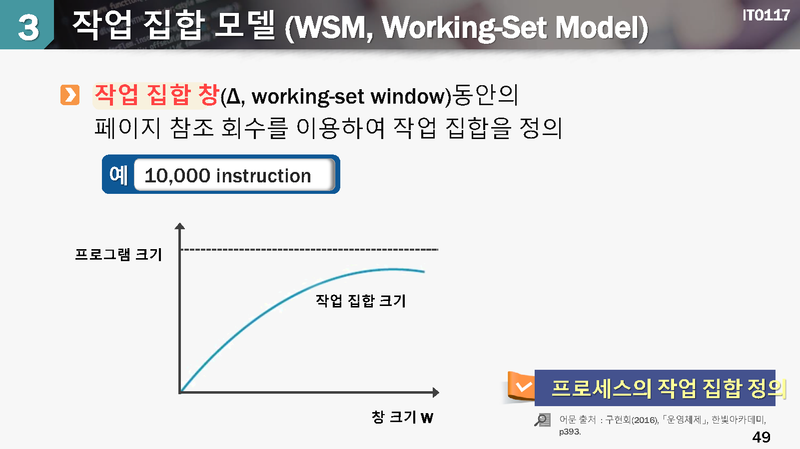

# 11 가상메모리

## 학습목표

* 가상메모리의 개념과 원리를 기술할 수 있다.
* 요구 페이징과 페이지 대치 알괴즘, 그리고 물리 페이지 할당의 개념을 설명할 수 있다.
* 스패싱의 발생원인을 이해하고 해결 방식을 설명할 수 있다.
* 

## 학습내용

1. 가상 메모리의 개념
2. 페이지 대치 알고리즘
3. 스래싱

# 1.가상 메모리의 개념

aaa

aaa

aaa

aaa

aaa

aaa

aaa

aaa

aaa

aaa

aaa

aaa

aaa

aaa

# 2. 페이지 대치 알고리즘

aaa

aaa

aaa

aaa

aaa

aaa

aaa

aaa

aaa

aaa

aaa

aaa

aaa

aaa

aaa

aaa

# 3. 스래싱

aaa

aaa

aaa

aaa

aaa

aaa

aaa

aaa

aaa

aaa

aaa

aaa

aaa

aaa

## 확인하기

## 정리하기

* 가상 메모리 기법을 사용하여 사요자가 메인 메모리의 용량을 초과한 프로세스에 주소를 지정하여 메모리를 제한없이 사용할 수 있도록 한다.
* 가상 메모리는 보통 요구 페이징 방식으로 구현하여 요구 페이징은 실행에 필요한 시점에 물리 메모리를 할당하여 적재한다.
* 페이지 부재는 물리 메모리에 적재되지 않은 영역에 접근할 때에 발생하며 페이지 부재 빈도를 최대한 낮추어야 성능 저하가 적다.
* 가상 메모리 기법을 도입함으로서 프로그래머가 물리 메모리의 크기를 신경쓰지 않아도 되었고, 다중 프로그래밍의 정도가 증가 하였다.
* 물리 메모리량에 대한 요구량이 시스템의 메모리 보유치보다 커지면 페이지 대치가 수행되며 이에 대한 여러가지 알고리즘이 제안되고 있다. -> 선입 선출 대치, 초지거페이지 대치, 최근 최소사용 대치등의 방식이 제안되고 있다.
* 페이지 부재가 너무 빈번하게 발생하여 페이지 대치가 계속 일어나는 스래싱이 발생할 수 있다. 이를 해결하기 위해서는 일부 프로세스를 스와핑시켜야 한다.
* 프래싱을 예방하기 위해서 작업집찹 모델을 사용하거나 직접적으로는 페이지 부재비니도 방식을 사용할 수 있다.
* 

