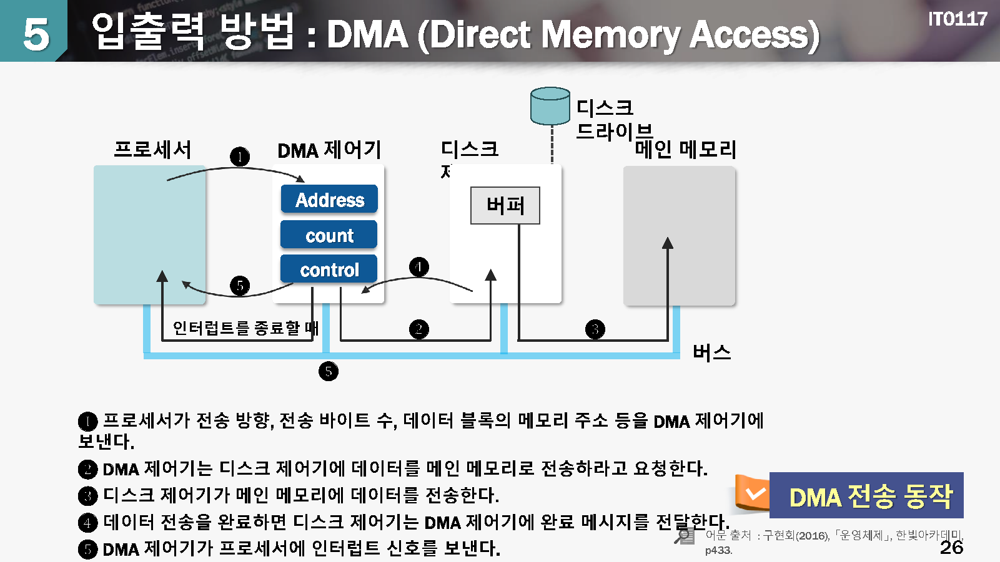

# 입출력 하드웨어

## 1.입출력 시스템의 개요

### 입출력 시스템

* **입출력 장치들을 관리**하면서 사용자에게 **접근 방법**을 제공하는 운영체제의 일부 시스템

#### 입출력 장치의 특성

 cpu에 비하여 **속도가 느리고** 자료를 **표현하는 방식이 다양**함

#### 입출력 장치의 종류

* Human readable IO Device : 프린터, 키보드, 마우스, 모니터 등
* Machine readable IO Device : 하드디스크, 모뎀, 센서 등

#### 입출력 시스템의 목적

CPU의 **효율**적인 사용

>  속도가 느린 입출력 장치와 빠른 CPU간의 자료 전달 과정을 정의

여러가지 기법을 사용하여 입출력 장치에 대한 **성능**을 향상

> 입추력 스케쥴링, 버퍼링, 캐싱등

수많은 입추력 장치에 대해서 **일관**된 인터페이스 젝공

## 2.입출력 제어기의 구성

aaa

입출력 제어기(입출력 모듈) = 포트, 버스, 입출력 장치를 제어하는 전자회로의 집합체

입출력 제어기를 통하여 입출력 장치에게 명령어나 자료를 전달

입출력 제어기에 존재하는 **레지스터(혹은 큐)**에 약속된 비트 패턴을 쓰거나 읽음으로써 입출력 동작을 수행

입출력 제어기기가 외부 장치의 타이밍과 데이터 형식, 기계적인 세부사항을 처리하므로 CPU는 단순히 파일 읽기/스기 명령만으로 입출력 장치를 제어할 수 있음

aaa

#### 입출력 주소 지정

CPU에서 입추력 장치 제어기의 레지스터(혹은 큐)에 접근하는 방식

입출력 맵(IO-Mapped IO)방식

> 메노리 주소공간과 입출력 주소공간이 별로로 정의됨
>
> 메모리 접근 명령어와 입출력 처리 명려어가 분리됨

메모리 맵 입출력(mamory-mapped IO)방식

> 메모리 주소공간과 입출력 주소공간이 같은 영역 내에 정의됨

aaa

aaa

#### 폴링 입출력 방법

폴링(polling) = CPU가 주변장치를 **연속하여 감시**하는 방안

장치의 제어기에 위지한 상태 레지스터를 주기적으로 읽어서 입력 데이터가 있는지를 확인하거나 출력 데이터를 처리할 수 있는지를 확인함

끊임없이 장치 제어기의 상태 레지스터 값을 확인해야 하기 때문에 CPU의 시간이 낭비되서 CPU의 처리 효율이 저하됨

아무런 이벤트가 없는 상환에서도 CPU가 불필요하게 장치 상태를 확인하는 경우에 비효율적임

aaa

aaa

#### 인터럽트 입출력 방법

인터럽트(interrupt) = CPU가 직접 주변 장치의 상태를 일일이 파악하지 않고 입출력 요구가 있을때에만 CPU가 관여하는 방식

주변장치가 데이터 전송을 위한 준비가 되면 CPU에게 인터럽트를 전달함

CPU는 인터럽트가 발생하면 현재 CPU의 상태를 저장하고, 인터럽트 핸들러의 절차를 수행함

불필요한 CPU의 시간낭비가 없기 때문에 폴링 방식에 비하여 CPU 성능을 높일 수 있음

​                                                          

aaa

aaa

#### DMA 입출력 방법(Direct Memory Access)

주변장치와 메모리간의 데이터 전달을 위하여 CPU가 관여하지 않고 주변장치와 메모리가 직접 수행 하도록 하는 방식

> PIO(Programmed I/O) = CPU 가 직접 입출력 동자가에 관여하는 방식

대량의 데이터 전달에 적절함

aaa

