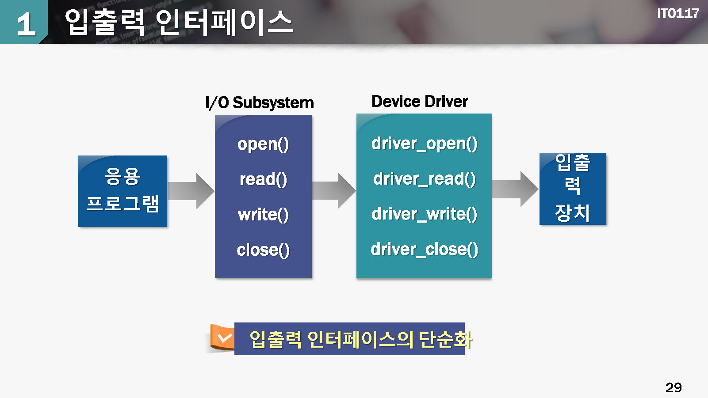
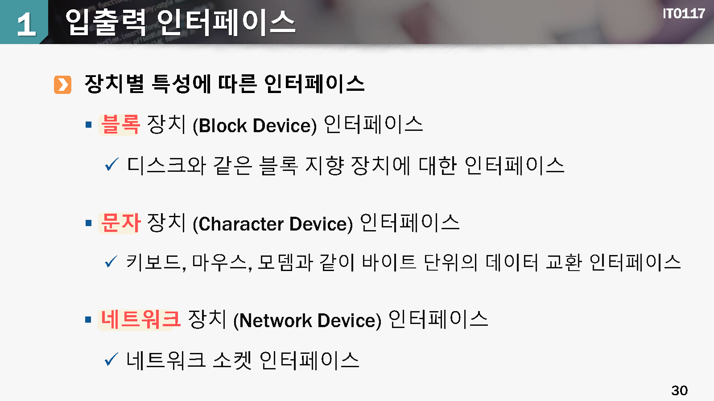
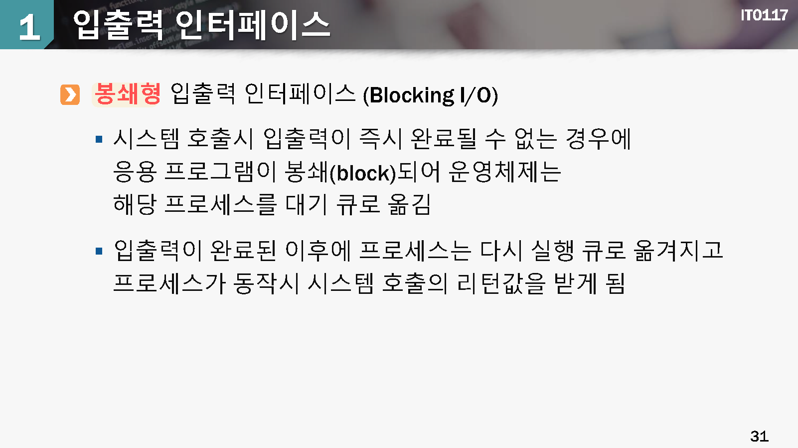
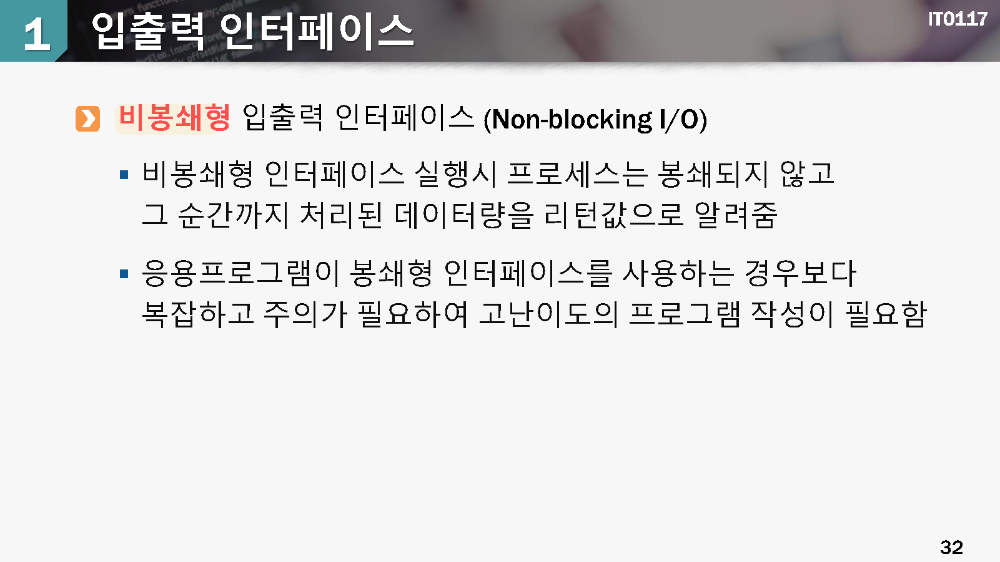
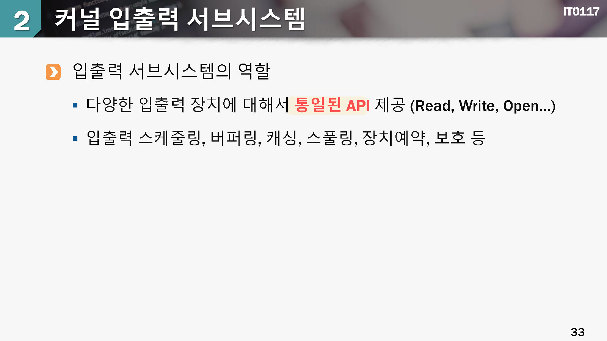
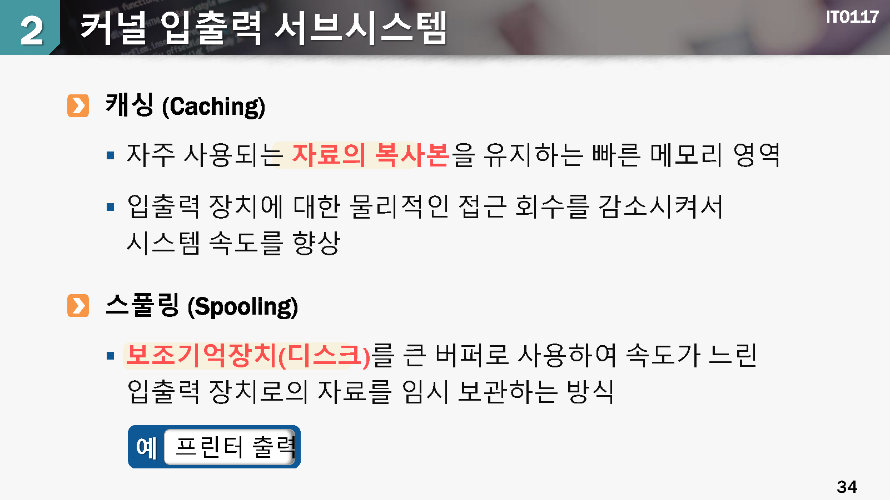
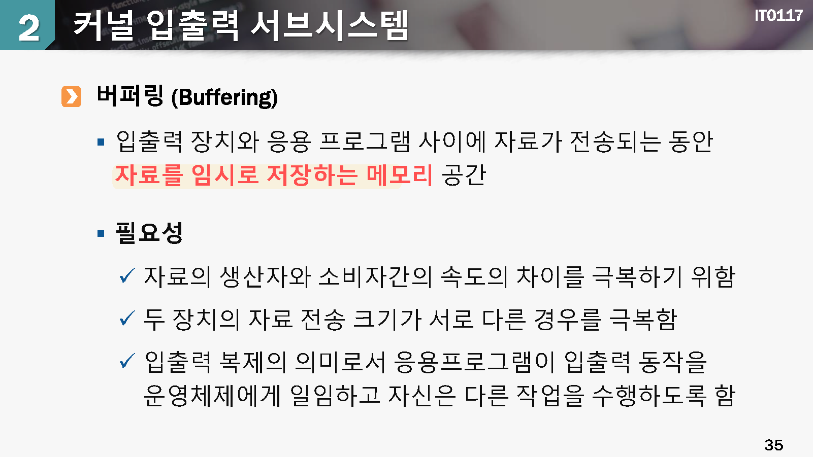

# 입출력 시스템의 구조

## 1. 입출력 인터페이스

aaa

aaa

aaa

aaa

aaa

## 2.커널 입추력 서브 시스템

aaa

aaa

aaa

## 3.입출력 효율의 향상

#### 입출력 효울이 중요한 이유

실제 동작하는 프로그램은 대부분 입추력 중심이 많음

CPU 성능은 상단히 빠르지만 입출력 장치의 속도는 대부분 느림

> CPU 연산 코드를 최적화하여 성능을 포이는 것보다, 입출력 효율을 높이면 더욱 좋은 효과를 얻을 수 있음

#### 입출력 효율을 향상시키는 원칙

* **문맥교환**의 빈도를 줄임
* 메모리에서 장치와 응용 프로그램 사이에 `자료가 복사되는 횟수`를 줄임
* `인터럽트와 폴링` 방식을 지혜롭게 사용하는 방법을 고려함
* DMA 방식을 활용하여 `CPU연산과 입출력 동작이 병행` 될 수 있음
* 원시 처리 연산을 하드웨어로 구현하여 장치 제어기 내에서 이루어지도록 함
* CPU, 메모리, 버스, 입출력등에 대한 부하가 규인하게 되도록 함

