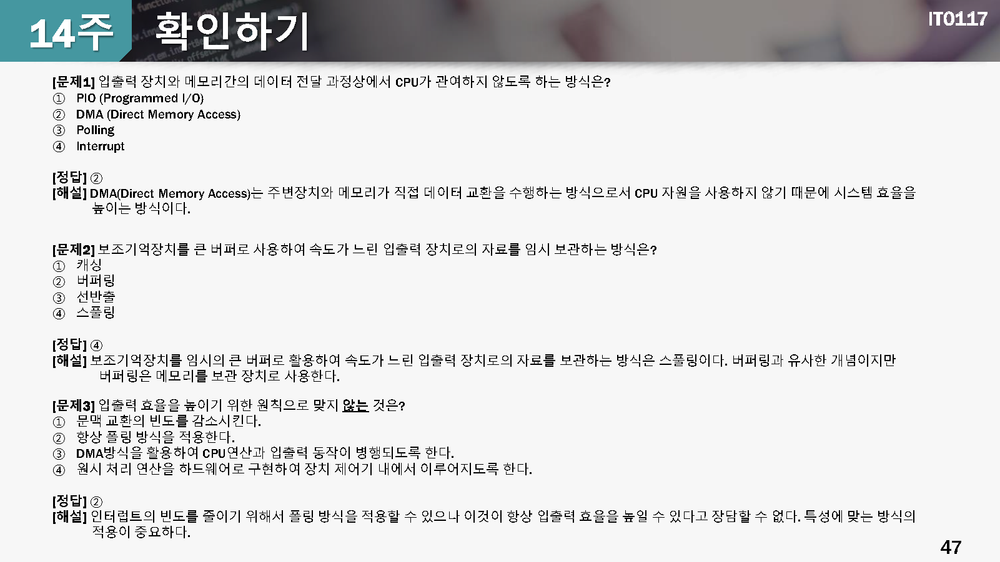

# 14 입출력 시스템
---

## 학습목표

* 운영체제의 **입출력 시스템 구조**를 설명할 수 있다.
* 입출력 하드웨어의 **원리**와 **입출력 시스템**을 기술할 수 있다.
* 입출력 **성능의 주요 요소**를 설명할 수 있다.

## 학습내용

1. [입출력 하드웨어](01)
2. [입출력 시스템의 구조](02)
3. [파일 정보 이용 실습](03)

## 확인하기 퀴즈

## 정리하기

1. 입출력 장치는 **속도가 느리고 자료를 표현하는 방식이 다양**함
2. 입출력 장치는 특정 포트나 버스에 연결되어 컴퓨터에 연결되며 **입출력 제어기**를 통하여 입출력 장치에게 명령어나 자료를 전달함
3. **폴링** 방시과 **입출력 시스템** 방식을 사용하여 CPU가 직접 입출력 장치에게 데이터나 명령어를 직접 수행하거나, **DMA**를 이용하여 수행함
4. 입출력 시스템은 실제 장치를 구동하는 **장치 드라이버**와 **입출력 시스템**으로 구분되어 사용자에게 일관된 인터페이스를 제공함
5. 입출력 시스템 호출은 많은 **CPU**자원을 사용함. 문맥전환, 인터럽트 처리 및 자료 복사에 따른 오버헤드가 크므로 **입출력 효율**을 높여야 함
6. **stat()** 함수를 호출하면 **입출력 시스템**의 구조체에 파일에 대한 다양한 정보가 저장되며 이를 이용하여 파일에 대한 여러 가지 정보를 획득할 수 있음

